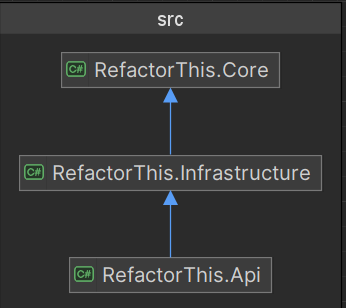

## The Problem

This is an API service which is required to manage products for users.

The original code has the following major issues:

- Vulnerable to SQL injection
- Business logic in the Controller, no separation of concerns
- No input validation
- No tests
- No API documentation

## The Task

The API needs to be refactored to meet production standards as well as easy for other developers to understand and develop new features. To achieve this goal, it needs to have a good and suitable software architecture, dependency injections for good unit test coverage, exception handling, logging and API documenting capability.

## My Approach

In terms of software architecture, I used a Domain-centric 3-Layer architecture. The three layers are listed below with a diagram generated by Rider.

- API layer: acts as an interface layer and manages endpoints, configurations, API docs etc.
- Core layer: it is the domain layer which manages all the business logic and DTOs.
- Infrastructure layer: handles the interaction with database in this case.


 
In my option, this architecture is a good fit for this project as it needs to achieve CRUD functionality with simple business logic and relationships. This architecture follows Inversion of Control (IoC) principle where API and Infrastructure depend on Core but Core does not a reference on either of them. 

As business logic is centralised in the Core layer within the Domain Models (Product and Option in this case). Unit testing can focus on testing the domain models without any mocks.

To solve the SQL injection vulnerability, I removed all the raw SQL and introduced Entity Framework Core for database access while retained the original database which is Sqlite that has two pre-seeded tables, Products and ProductOptions with One-to-Many relationship.

I have implemented the following frameworks and Nuget packages to refactor the API to meet production standards:

- Entity Framework Core
- Upgraded to .NET 8
- Swagger for API documentation and testing
- Serilog for logging into console
- xUnit for Unit Tests and component Tests
- `csharpfunctionextensions` nuget package that enable the use of `Result<>` return type
- `Microsoft.Extensions.DependencyInjection.Abstractions` to enable dependency injection

## How To Run

### Prerequesite
- Install [Microsoft .NET 8 SDK](https://dotnet.microsoft.com/en-us/download/dotnet/8.0)
- An IDE that supports .NET - Rider was used for the development of this project. You should be able to run with VS Code (with a few extensions: `C# Dev Kit` is recommended) and the latest Visual Studio.
- Docker (optional)

### Command Line Interface
```shell
# clone repository
git clone https://github.com/cprobbie/RefactorTask.git

cd ./RefactorTask

# build the project
dotnet build

# Run test project
dotnet test ./tests/RefactorThis.Tests.Unit
dotnet test ./tests/RefactorThis.Tests.Component

# Run the project
dotnet run --project .\src\RefactorThis.Api\RefactorThis.Api.csproj --launch-profile "RefactorThis"
```

### IDE
In your preferred IDE, select launch profile `RefactorThis` and click the **Run** button. It should open up `http://localhost:5000/swagger/index.html` on your default browser.

### Docker
This is an useful option if you just wanted to test the App without having to compile the C# code. On the other hand, you won't be able to run the tests.
```shell
# Make sure you have docker installed
docker --version

# clone repository
git clone https://github.com/cprobbie/RefactorTask.git
cd ./RefactorTask

# docker build and run
docker build -t refactorthis_api .
docker run --rm -p 5000:8080 -e ASPNETCORE_URLS=http://+:8080 refactorthis_api

# check if the server is up. It will return Healthy if the server is up
curl http://localhost:5000/ping
```
 
## How To Test

Once the project server is up and running, visit: http://localhost:5000/swagger/index.html via your preferred browser.

You should see RefactorThis API v1 endpoints and you are ready to play. After clicking on any of the endpoints, it will show a **[Try it out]** button. Click on it and you can enter your inputs and click on the **[Execute]** button to send a request. You will see the HTTP status code and response message in the Responses section.

You may want to start with `GET Products: /api/v1/products` to find out what products are currently in the database.

I have included some example payloads for POST and PUT endpoints below.

**POST** `/api/v1/Products` 

**PUT** `/api/v1/Product/{id}`

```json
{
  "Name": "iPad Pro",
  "Description": "a nice and big iPad",
  "Price": 999.98,
  "DeliveryPrice": 7.99
}
```

**POST** `/api/v1/products/{id}/options/{optionId}` 

**PUT** `/api/v1/products/{id}/options/{optionId}`

```json
{
  "Name": "Light green",
  "Description": "the coolest green color"
}
```
### Unhappy paths
Validation logic has been implemented. If you try to create/update a new product with negative price, you will get a Bad Request return with an error message.
You may also try to `Get` a product or an option by providing a wrong Id.

## Where to check logs

It's important that you can keep track of the requests. Application logs are available in the terminal.

---

# refactor-this
The attached project is a poorly written products API in C#.

Please evaluate and refactor areas where you think can be improved. 

Consider all aspects of good software engineering and show us how you'll make it #beautiful and make it a production ready code.

## Getting started for applicants

There should be these endpoints:

1. `GET /products` - gets all products.
2. `GET /products?name={name}` - finds all products matching the specified name.
3. `GET /products/{id}` - gets the project that matches the specified ID - ID is a GUID.
4. `POST /products` - creates a new product.
5. `PUT /products/{id}` - updates a product.
6. `DELETE /products/{id}` - deletes a product and its options.
7. `GET /products/{id}/options` - finds all options for a specified product.
8. `GET /products/{id}/options/{optionId}` - finds the specified product option for the specified product.
9. `POST /products/{id}/options` - adds a new product option to the specified product.
10. `PUT /products/{id}/options/{optionId}` - updates the specified product option.
11. `DELETE /products/{id}/options/{optionId}` - deletes the specified product option.

All models are specified in the `/Models` folder, but should conform to:

**Product:**
```
{
  "Id": "01234567-89ab-cdef-0123-456789abcdef",
  "Name": "Product name",
  "Description": "Product description",
  "Price": 123.45,
  "DeliveryPrice": 12.34
}
```

**Products:**
```
{
  "Items": [
    {
      // product
    },
    {
      // product
    }
  ]
}
```

**Product Option:**
```
{
  "Id": "01234567-89ab-cdef-0123-456789abcdef",
  "Name": "Product name",
  "Description": "Product description"
}
```

**Product Options:**
```
{
  "Items": [
    {
      // product option
    },
    {
      // product option
    }
  ]
}
```
